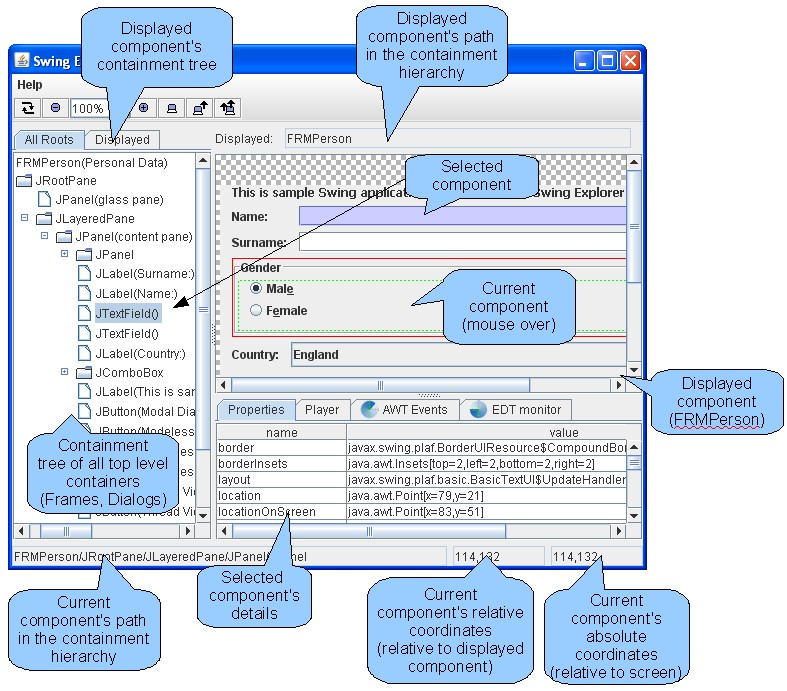

SwingExplorer Tips
=====================

### Parts of the Swing Explorer GUI



### Finding source code where a component is added into a container

Swing Explorer has an "Addition trace" tab at the bottom. It is useful when you have a quite complicated UI code and want to find a source code line where a component was added into a container. It contains the full stack trace of the instruction responsible for adding a selected component into a container. The stack trace is automatically changed/refreshed when you select some other component in the tree or on the display area.

Looking at the "Addition trace" shown on the figure below it is easy to figure out that "JLabel(Name:)" component was added into a container in the 34 line of the PersonalDataFrame3.java file. The stack trace elements have hyperlinks. Clicking a hyperlink opens the selected source line in the IDE.

Attention: The hyperlink navigation functionality is available only when Swing Explorer is launched using and IDE plug-in.

Here is the source code fragment from the sample application:

```java
public class PersonalDataFrame3 extends JFrame {
        public PersonalDataFrame3() {
                JPanel contentPane = new JPanel(new BorderLayout());
                setContentPane(contentPane);
                contentPane.setBorder(new EmptyBorder(5, 5, 5, 5));

                JPanel pnlName = new JPanel(new GridBagLayout());
                pnlName.add(new JLabel("Name: "), new GridBagConstraints(0, 0, 1, 1, 0, 0,
                                                              NORTHWEST, NONE, new Insets(0, 0, 0, 0), 0, 0));
                pnlName.add(new JTextField("John"), new GridBagConstraints(1, 0, 1, 1, 1, 0,
                                                              WEST, HORIZONTAL, new Insets(0, 0, 0, 0), 0, 0));
                // ...
        }
}

```

Additionally you can dump this stack trace to the console using the right click menu on a selected component like it is shown on the screenshot below.

*TODO: Find the old screenshot that goes here.*

### Observing a component's preferred size

Sometimes it is important to know a preferred size of a Swing component to estimate how does it impact the real component's size when the component has been layed out. To view the preferred size it is necessary to switch on the "Show Preferred size" checkbox. After that you will see an additional rectangle showing the preferred size when you move mouse over a component. The preferred size is shown as a black rectangle.

### Launching Swing Explorer from the command line

To launch Swing Explorer from IDE it is recommended to use IDE plugins. Currently plug-ins for NetBeans and Eclipse IDE are available. In case you want to use Swing Explorer without IDE or just execute it manually you have to download the following two Jar files from:
 * swexpl.jar - Swing Explorer UI
 * swag.jar - Instrumentation agent

There is currently no download page. Sorry.

The instrumentation agent optional. It is needed when Event Dispatch Thread violation monitoring or Addition trace functionality is necessary. If you don't need it you can leave with just swexpl.jar. To launch full version of Swing Explorer with your application please download Jar files mentioned above and use the following command:

```shell
    java -javaagent:swag.jar -Xbootclasspath/a:swag.jar -cp swexpl.jar;<your_class_path> org.swingexplorer.Launcher <your_main_class>
```

For instance, for SwingSet the command line looks like this:

```shell
    java -javaagent:swag.jar -Xbootclasspath/a:swag.jar -classpath swexpl.jar;SwingSet2.jar org.swingexplorer.Launcher SwingSet2
```
