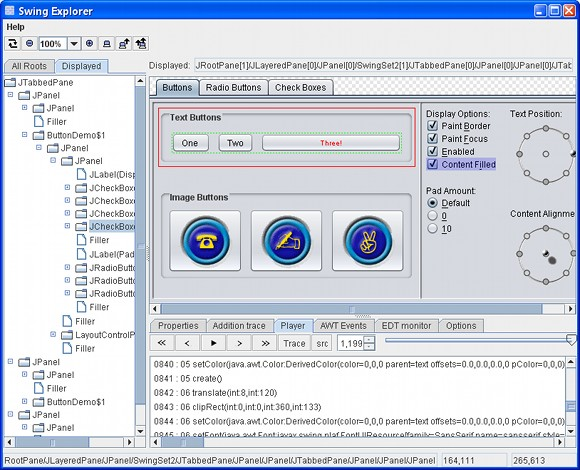

SwingExplorer
=============

Does your Swing application look strange? Is it hard to understand why?

Try the Swing Explorer tool! Discover your issues and save your time!

Swing Explorer is an Open Source tool for Swing application developers which is intended for visual exploration of Swing-based application internals.

## Features

* Find all top-level components (Windows, Frames, Dialogs)
* Browse through the component hierarchy
* Monitor AWT/Swing events
* Debug 2D graphics
* Dig into source code
* Monitor threading rule violations

## Download

Swing Explorer is hosted [on GitHub](https://github.com/swingexplorer/swingexplorer-core).

## License

Swing Explorer is licensed under the [LGPL v3.0](https://www.gnu.org/licenses/lgpl-3.0.en.html).
